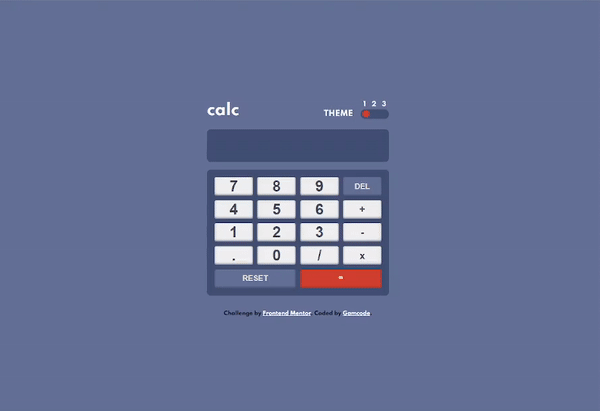

# Frontend Mentor - Calculator app solution

This is a solution to the [Calculator app challenge on Frontend Mentor](https://www.frontendmentor.io/challenges/calculator-app-9lteq5N29). Frontend Mentor challenges help you improve your coding skills by building realistic projects. 

## Table of contents

- [Overview](#overview)
  - [The challenge](#the-challenge)
  - [Gif demo](#gif)
  - [Links](#links)
- [My process](#my-process)
  - [Built with](#built-with)
  - [What I learned](#what-i-learned)
  - [Continued development](#continued-development)
- [Author](#author)
- [Acknowledgments](#acknowledgments)

## Overview

### The challenge

Users should be able to:

- See the size of the elements adjust based on their device's screen size
- Perform mathmatical operations like addition, subtraction, multiplication, and division
- Adjust the color theme based on their preference
- **Bonus**: Have their initial theme preference checked using `prefers-color-scheme` and have any additional changes saved in the browser

### gif

### Links

- Solution URL: [GitHub repository](https://github.com/gamcode98/Calculator-app-challenge-hub)
- Live Site URL: [Live site URL](https://calculator-app-main-gamcode.netlify.app/)

## My process

### Built with

- Semantic HTML5 markup
- CSS custom properties
- Flexbox
- CSS Grid
- Mobile-first workflow
- JavaScript vanilla

### What I learned

With this project I've improved my ability with JavaScript, manipulating the DOM, and using CSS custom properties to change the appearance theme.

### Continued development

This is an update to this readme file. This was almost 2 years ago. I've learned a lot in the process.
This was a great learning experience for me to continue to improve and learn more about JavaScript and in these moments I'm still learning but with frameworks like React I can continue to build my projects.

## Author

- Website - [Gabriel Alejandro Mamani](https://portfolio-gamcode.netlify.app)
- Frontend Mentor - [@gamcode98](https://www.frontendmentor.io/profile/gamcode98)

## Acknowledgments

Thank you for this project Frontend Mentor.
